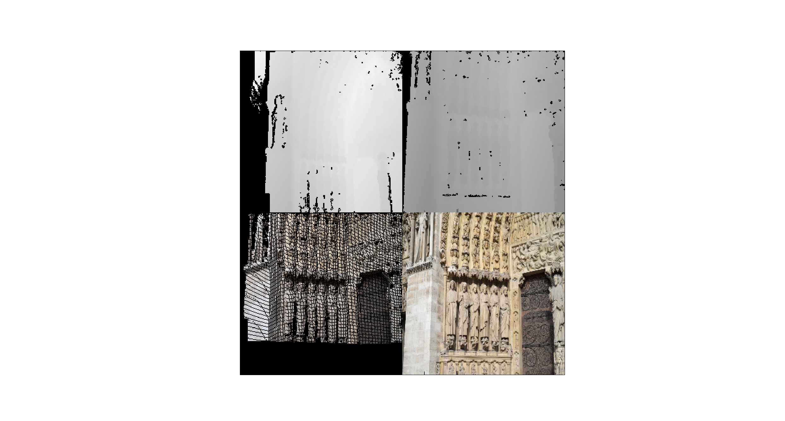

## visualize.py

An example tool for visualizing geometric labels or reconstruction results.

Visualize image keypoints.
```
python visualize.py kpt
```


Visualize matching results.
```
python visualize.py match
```


Visualize overlap masks.
```
python visualize.py mask
```


Visualize depth maps.
```
python visualize.py depth
```
