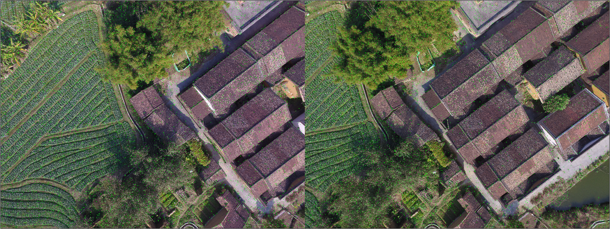
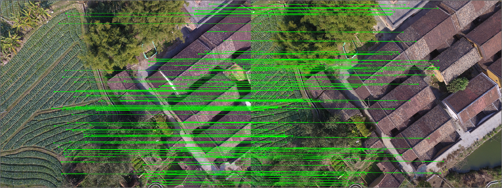
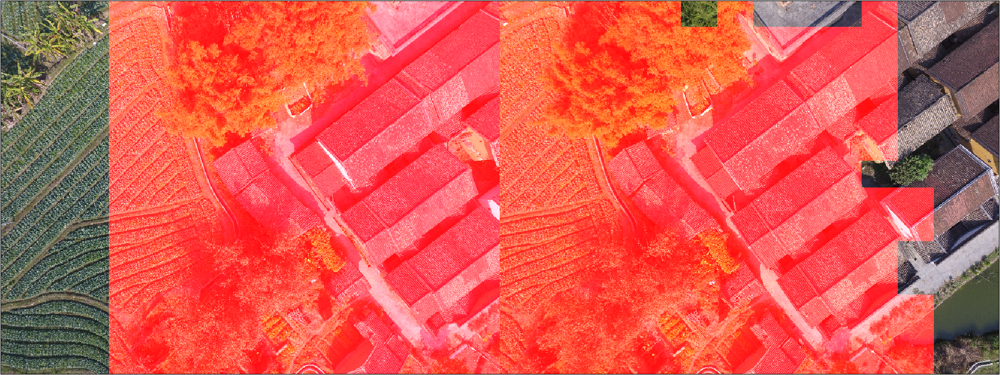

## visualize.py

An example tool for visualizing the geometric labels or reconstruction results.

Visualize image keypoints.
```
python visualize.py kpt
```



Visualize matching results.
```
python visualize.py match
```


Visualize overlapping masks.
```
python visualize.py match
```
